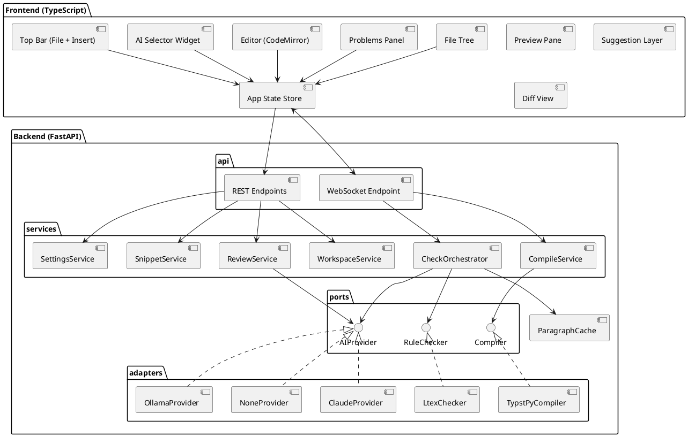
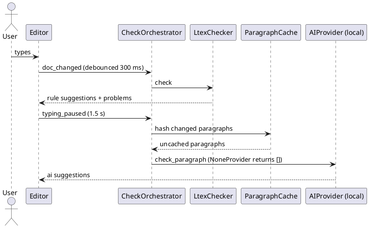
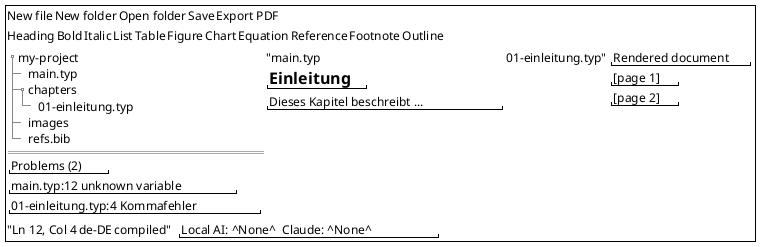

# CLAUDE.md – typst-writer

Local, offline-first Typst editor with a Word-like workflow: file handling and insert toolbar at the top, file tree and problems on the left, source in the middle, always up-to-date rendered document on the right. Rule-based grammar checking (German + English) and **optional** AI assistance (local model and/or Claude).

Read this file completely before every session. Work phase by phase (see "Phases"). Do not start a new phase without my confirmation.

---

## 1. Goals and hard constraints

### Functional
- Open a folder as workspace; create, open, save, rename `.typ` files.
- Insert toolbar that writes correct Typst code for headings, tables, figures, charts, equations, references etc. (Word-like, no need to remember syntax).
- Edit `.typ` files with syntax highlighting; live rendered preview; PDF export.
- Problems panel with compile errors/warnings and grammar issues, click to jump to the location.
- Rule-based grammar/spelling underlines via LTeX+ (German `de-DE` and English), always offline.
- **Local AI live check** (optional): context-aware suggestions per paragraph after a typing pause.
- **Claude review** (optional): select text → shortcut → revised text as a diff with accept/reject per change.

### AI must always be optional
- The editor must be fully usable with **no AI at all**. Default setting: both AI slots = `None`.
- Bottom-right corner of the window: **AI selector widget** with two independent dropdowns:
  - `Local AI:` `None` + models reported by the local Ollama instance.
  - `Claude:` `None` + Claude models (CLI aliases such as `sonnet`) from `config.toml`.
- If Ollama is not reachable → local dropdown shows only `None` (disabled, tooltip explains why).
- If the `claude` command (Claude Code) is not installed or not logged in → Claude dropdown shows only `None` (disabled, tooltip explains why). **User decision:** no API keys; Claude runs through the user's Claude Code login.
- Local slot drives the live check. Claude slot drives the on-demand review. No hidden fallback from one to the other.
- If Claude = `None`, the review shortcut and context-menu entry are disabled.
- Selection is persisted in the local settings file and restored on start.

### Non-functional
- Offline-first: everything except the Claude API works without internet. Typst packages used by the insert toolbar (e.g. charts) are downloaded once and cached locally.
- Latency targets: rule underlines < 500 ms after typing; preview < 1 s for typical documents; local AI suggestions ~1–3 s after pause.
- Runs only on `127.0.0.1`. No telemetry.

### Code standards
- Python 3.12, **full type hints on all functions, arguments and return values**. `mypy --strict` and `ruff` must pass.
- TypeScript in `strict` mode.
- Lean implementations: no unnecessary dependencies, no premature abstraction beyond the ports defined below.
- Diagrams in PlantUML.

### Security
- Bind server to `127.0.0.1` only; CORS restricted to the local frontend origin.
- No API keys. The `claude` CLI subprocess gets a fixed argument list (no shell), the prompt on stdin, no tools (`--tools ""`), no MCP servers (`--strict-mcp-config`), an empty temp dir as working directory, an environment without `ANTHROPIC_API_KEY`, and a timeout. Its credentials are never read, logged or sent to the frontend.
- All file access restricted to the opened workspace root (reject path traversal, resolve symlinks). File names for new files validated (allowed characters, `.typ` extension, no overwrite without confirmation).
- Size limits on WebSocket messages and on text sent to AI providers.
- Treat AI output as untrusted data: validate JSON with Pydantic, never execute it, only apply replacements after user confirmation.
- Subprocesses (LTeX+, Tinymist, `claude`) started with fixed argument lists, no shell.

---

## 2. Tech stack

| Part | Choice | Reason |
|---|---|---|
| Backend | Python 3.12, **FastAPI** + **Uvicorn** | Native async and WebSockets (live preview, streaming AI, several LSP processes in parallel); Pydantic models match the full-type-hint standard |
| Typst | `typst` (typst-py), version pinned | Compile to SVG pages (preview) and PDF (export) |
| Rule checks | LTeX+ (`ltex-ls-plus`) via LSP over stdio | Typst-aware, offline, German |
| Completion (Phase 6) | Tinymist via LSP | Typst completion and diagnostics |
| Local AI | Ollama HTTP API via `httpx` | Swappable local models |
| Claude | Claude Code CLI (`claude -p --output-format json --json-schema …`) | User decision: uses the existing Claude login, no API key, no SDK; structured output |
| Frontend | TypeScript, Vite, CodeMirror 6 | Clean web UI, lint/underline support |
| Desktop window (Phase 7) | pywebview (Edge WebView2 on Windows) | Native app window, same UI code |
| Tooling | uv, pytest, mypy, ruff, vitest, Playwright | |

Flask was considered and rejected: it is sync-first, WebSockets need extra plugins, and parallel async work (compile + LSP + AI) is awkward.

---

## 3. Architecture

Hexagonal (ports and adapters). Business logic depends only on ports (Python `Protocol`s), never on concrete tools. "No AI" is implemented with the Null Object pattern (`NoneProvider`), so services never branch on "is AI enabled".



### Ports (sketch, adapt as needed)

```python
from pathlib import Path
from typing import Protocol

class Compiler(Protocol):
    async def to_svg_pages(self, source: str, root: Path) -> CompileResult: ...
    async def to_pdf(self, source: str, root: Path) -> bytes: ...

class RuleChecker(Protocol):
    async def check(self, uri: str, source: str, language: str) -> list[Suggestion]: ...

class AIProvider(Protocol):
    name: str
    async def available_models(self) -> list[str]: ...
    async def check_paragraph(self, req: ParagraphCheckRequest) -> list[Suggestion]: ...
    async def review_selection(self, req: ReviewRequest) -> ReviewResult: ...
```

### Core data model (Pydantic)
- `Suggestion`: `id`, `source` (`rule` | `local_ai` | `claude`), `start`, `end` (character offsets in source), `original`, `replacement`, `reason`, `category`.
- `Problem`: `file`, `line`, `column`, `severity` (`error` | `warning` | `grammar` | `ai`), `message`, `source`.
- `Snippet`: `id`, `label`, `group`, `template` (Typst code with placeholders), `required_packages`.
- `ReviewRequest`: `selection`, `context_before`, `context_after`, `glossary`, `mode` (`check` | `improve` | `shorten` | `explain`), `language`.
- `ReviewResult`: `revised_text`, `changes: list[Suggestion]`.
- `AISettings`: `local_model: str | None`, `claude_model: str | None`.

### Live check flow



### Rules for AI adapters
- Prompts: German/English academic writing; never change Typst markup (`#...`, `$...$`, `@ref`, `<label>`, code blocks). Return JSON only.
- After receiving a result, verify that all markup tokens of the original still exist; otherwise drop that change.
- Map suggestions to offsets by locating `original` inside the paragraph; drop suggestions that cannot be located uniquely.
- Cache key: `sha256(paragraph + model + mode)`.
- Cancel outdated requests when the paragraph changes again.
- Claude model IDs come from `config.toml`, not from code.

### Insert toolbar (snippets)
- Snippets are defined as data in `snippets.toml`, not hard-coded in the UI.
- Simple snippets insert at the cursor or wrap the selection (bold, italic, heading levels).
- Complex snippets open a small dialog, then generate code:
  - **Table:** rows/columns, header row → `#table(...)` inside `#figure(...)` with caption and label.
  - **Figure/Image:** pick image from workspace → `#figure(image(...), caption: [...]) <fig:...>`.
  - **Chart:** pick CSV from workspace, chart type (line/bar/scatter), axis labels → chart code using a Typst plotting package; package version pinned and cached.
  - **Equation:** inline or block, optional label.
  - **Reference/Citation:** list existing labels and bibliography keys from the workspace.
- Every snippet must compile with the pinned Typst version (covered by tests).

### WebSocket messages (JSON, typed on both sides)
- Client → server: `open_file`, `doc_changed`, `typing_paused`, `set_ai_settings`.
- Server → client: `preview_pages`, `problems`, `suggestions` (with `source`), `ai_status` (`available`, `reason`), `workspace_changed`.
- REST: workspace operations (`/api/workspace/*`), snippets (`/api/snippets`), export (`/api/export/pdf`), review (`POST /api/review`, streaming).

---

## 4. UI

**A sketch of the overlay will be provided at `docs/ui-sketch.png`.** Follow it for visual style and details. If the sketch conflicts with this layout, ask me before deciding.

Resolved sketch conflicts:
- Top bar is a single row: file actions on the left, divider, insert toolbar ("Typst functions") on the right.
- The status bar stays as specified below; the AI selector sits at its right end (bottom-right corner of the window), not floating over the preview.
- Frontend uses plain TypeScript, no UI framework.

### Layout (fixed requirements)
- **Top bar**
  - File actions: New `.typ` file, New folder, Open folder (workspace), Save, Export PDF.
  - Insert toolbar: Heading (level dropdown), Bold, Italic, List, Table, Figure/Image, Chart, Equation, Reference/Citation, Footnote, Outline, Page break.
- **Left column (resizable)**
  - Top: **file tree** of the workspace (create, rename, delete via context menu; delete asks for confirmation).
  - Bottom: **problems panel** listing compile errors/warnings and grammar/AI issues, grouped by file, click to jump.
- **Middle:** the opened `.typ` file in the editor (tabs for multiple open files).
- **Right:** rendered document, always up to date, page by page (SVG from the same compile as the PDF export, so the layout is identical); zoom and fit-to-width; click in preview jumps to source (Phase 6).
- **Bottom status bar:** cursor position, language (`de-DE` / `en-US`), compile status; **AI selector widget in the bottom-right corner**.

Rough wireframe (the sketch overrides this):



### Interaction details
- Underline colors by source: rule = red, local AI = blue, Claude = purple (diff view).
- Hover on underline → card with reason and "Apply" / "Ignore".
- Review: select text → `Ctrl+Shift+K` → mode picker (Check / Improve / Shorten / Explain) → diff view.
- Light and dark theme; clean, minimal look.

---

## 5. Project structure

```
typst-writer/
├── CLAUDE.md
├── config.toml              # model lists, debounce times, limits
├── snippets.toml            # insert toolbar definitions
├── docs/ui-sketch.png
├── .claude/skills/          # project skills (see section 7)
├── backend/
│   ├── pyproject.toml
│   ├── src/typst_writer/
│   │   ├── main.py          # FastAPI app factory, startup/shutdown
│   │   ├── api/             # websocket.py, rest.py, schemas.py
│   │   ├── services/        # workspace, compile, snippets, check_orchestrator, review, settings
│   │   ├── ports/           # Protocols
│   │   ├── adapters/        # typst_py, ltex, ollama, claude, none
│   │   ├── domain/          # models, paragraph splitting, offsets
│   │   └── infra/           # lsp_client.py, cache.py, paths.py (workspace guard)
│   └── tests/
└── frontend/
    ├── package.json
    └── src/
        ├── layout/          # panels, resizing, status bar
        ├── topbar/          # file actions, insert toolbar, snippet dialogs
        ├── filetree/
        ├── problems/
        ├── editor/          # CodeMirror setup, typst highlighting, tabs
        ├── preview/
        ├── suggestions/     # underline layer, hover card
        ├── review/          # diff view
        ├── ai-selector/     # bottom-right widget
        ├── state/
        └── api/             # typed WebSocket/REST client
```

---

## 6. Phases

Each phase: plan first, then implement, then tests, then a short summary of what changed. Update "Progress" at the end of this file.

| Phase | Deliverable | Acceptance criteria |
|---|---|---|
| **0. Setup** | Repo skeleton, uv + Vite, one start command, linters, pinned Typst version | Start script runs both; mypy/ruff/tsc pass |
| **1. Core layout** | Full panel layout, top bar file actions, workspace service, file tree, editor with tabs, SVG live preview, problems panel (compile errors), PDF export, status bar | Open folder, create/edit/save `.typ`, preview < 1 s, errors clickable, path traversal test passes |
| **2. Insert toolbar** | `snippets.toml`, snippet service, simple snippets, dialogs for table/figure/chart/equation/reference, package caching | Every snippet compiles in tests; chart from CSV renders offline after first package download |
| **3. AI selector + Claude review** | Settings service, bottom-right widget, `NoneProvider`, `ClaudeProvider`, diff view | Works with both slots = `None`; selection review returns diff; accept/reject per change; markup preserved |
| **4. LTeX+ rule checks** | LSP client, `LtexChecker`, underline layer, problems integration, quick fixes, language setting | German errors underlined < 500 ms; no false alarms on Typst markup in test file |
| **5. Local AI live check** | `OllamaProvider`, paragraph cache, pause trigger, request cancellation | Suggestions appear after pause; unchanged paragraphs never re-sent; Ollama offline → graceful `None` |
| **6. Polish** | Tinymist completion, glossary editor, themes, click-to-jump preview ↔ source | Daily use without friction |
| **7. Desktop app** | pywebview window, single start command/shortcut | Starts like a normal program |

### Testing
- Unit tests for paragraph splitting, offset mapping, markup-preservation check, cache, workspace path guard, file name validation, snippet generation.
- Snippet tests: each generated snippet compiles with the pinned Typst version.
- Adapter tests with fakes/mocks; no real API calls in automated tests.
- UI tests with Playwright for the main flows (open folder, edit, preview updates, insert table, problems click-to-jump).
- One integration test per phase covering the acceptance criteria.

---

## 7. Skills and tools

Use these skills when they are installed. At the start of a session, check which skills are available. **If a skill listed here is missing, do not work around it silently: tell me which one is missing and the install command, then wait.**

| Skill / tool | Use for | Install (I run this in Claude Code) |
|---|---|---|
| `frontend-design` (Anthropic) | All UI work: layout, top bar, panels, theme, dialogs. Goal: clean, minimal, not generic | `/plugin marketplace add anthropics/skills` then `/plugin install frontend-design@anthropic-agent-skills` |
| `webapp-testing` (Anthropic, Playwright) | Verifying UI flows after each phase that touches the frontend | From the same marketplace (`/plugin` → browse `anthropic-agent-skills`) |
| `skill-creator` (Anthropic) | Creating the project skill `typst-syntax` (below) | From the same marketplace |
| `/security-review` (built in) | Before closing each phase; remind me to run it | Built in, no install |
| Context7 MCP (optional) | Current docs for FastAPI, CodeMirror 6, typst-py, Typst and plotting packages | Add as MCP server if available |

### Project skill to create in Phase 2: `.claude/skills/typst-syntax/`
- Purpose: correct Typst syntax for the pinned version, because Typst syntax changes between versions and generated code is easy to get wrong.
- Contents: verified snippet patterns (headings, figures, tables, equations, references, bibliography, chart package usage), common mistakes, and the rule "check against the official Typst docs for the pinned version when unsure".
- Use it whenever writing or changing snippets or Typst test files.

---

## 8. Working rules for Claude Code
- Start each session by reading this file and the Progress section.
- Use plan mode before implementing a phase; show me the plan.
- Small, focused commits with clear messages.
- Ask before adding a dependency not listed in section 2.
- Do not weaken the constraints in section 1 to make something work; ask instead.

---

## Progress
- [x] Phase 0 – Setup
  - Start: `python scripts/dev.py` (backend 127.0.0.1:8000 with reload, Vite 127.0.0.1:5173 proxying `/api` and `/ws`). Check: `python scripts/check.py` (ruff, ruff format, mypy --strict, pytest, tsc, vitest).
  - Typst pinned to 0.15.0 (typst-py); backend refuses to start on mismatch with `config.toml`. Ruff is configured repo-wide in `ruff.toml`.
  - typst-py returns `bytes` (not a list) for single-page SVG output; the Phase 1 compiler adapter must normalize this.
  - Open: Starlette's TestClient prefers `httpx2` over `httpx` (warning silenced in pytest config).
  - Skills: in cloud sessions install with `claude plugin marketplace add anthropics/skills` + `claude plugin install example-skills@anthropic-agent-skills` (contains `frontend-design`, `webapp-testing`, `skill-creator`; there is no separate `webapp-testing` plugin).
  - Cloud sessions block `packages.typst.org` and GitHub release downloads — needed for Phase 2 (chart package) and Phase 4 (LTeX+).
- [x] Phase 1 – Core layout
  - **Preview always renders the main file** (user decision), including unsaved edits in any open file: `infra/shadow.py` mirrors the workspace into the cache dir (hard links, copy fallback) and writes unsaved buffers there; the workspace is never written by compiles. Main = `main.typ` by default, or "Set as main file" (persisted per workspace in `<config dir>/state.json`, with the last opened folder). New `.typ` file becomes main if none is set.
  - Open folder = dialog with a path field plus sub-folder list (`/api/workspace/browse`); a native dialog comes with pywebview in Phase 7.
  - WebSocket messages differ from section 3: client sends `doc_changed`, `doc_closed`, `refresh` (no `open_file`; files are read via REST); server sends `compile_status` in addition. `preview_pages` sends only changed pages (`svg: null` = unchanged).
  - typst-py reports only the **first** compile error (plus all warnings); columns are 0-based characters (adapter converts to 1-based).
  - Security additions: `TrustedHostMiddleware` (DNS rebinding), WebSocket `Origin` check, preview pages rendered as `` SVG blobs (no script/link execution), delete/rename act on symlinks themselves.
  - UI tests: `python scripts/check.py --e2e` (Python Playwright in `e2e/`, needs free ports 8000/5173; in cloud sessions set `PLAYWRIGHT_CHROMIUM_EXECUTABLE=/opt/pw-browsers/chromium-1194/chrome-linux/chrome`). Design tokens and principles: `docs/design.md`.
- [x] Phase 2 – Insert toolbar (**without Chart**, see next item)
  - `snippets.toml` (repo root) defines the toolbar: kinds `wrap`, `line_prefix` (toggles, replaces heading/list markers), `block`, `dialog`; snippets sharing a `group` become a dropdown; `shortcut` (Mod-b/Mod-i) and `in_toolbar = false` (bibliography, offered inside the Reference dialog).
  - Dialog code is generated **only in the backend** (`services/snippets.py`, `POST /api/snippets/{id}/render`); dialogs show a live preview of exactly that code. `POST /api/workspace/references` indexes labels, `.bib` keys, images and whether `#bibliography` is called (unsaved buffers included).
  - Generated Typst follows the project skill `.claude/skills/typst-syntax/` (verified against 0.15.0; its example project is compiled in the tests). Key rules: escape `\ # $ * _ [ ] @ < > ` ~ /` and a leading `= - + 1.` in user text; image/bibliography paths root-relative (`/bilder/x.png`); labelled block equations use `#math.equation(..., numbering: "(1)")`.
  - Every snippet compiles in `backend/tests/test_snippets.py` (typical + hostile input, subfolder chapter); UI flows in `e2e/test_insert.py`.
- [ ] Phase 2b – Chart snippet (CSV → plotting package) + Typst package download/caching — **deferred by the user** because this cloud environment blocks `packages.typst.org`. `DialogKind` already reserves `chart`.
- [ ] Phase 3 – AI selector + Claude review
- [ ] Phase 4 – LTeX+ rule checks
- [ ] Phase 5 – Local AI live check
- [ ] Phase 6 – Polish
- [ ] Phase 7 – Desktop app
